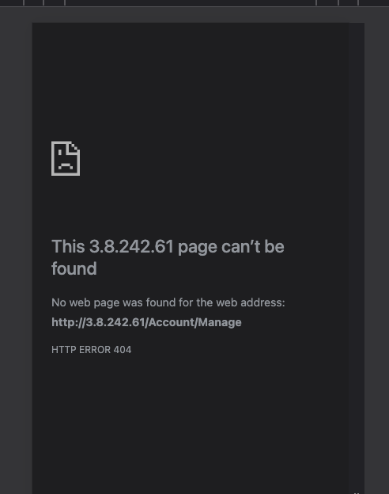

# Ten10 Technical Test

This project contains automated tests for the Ten10 Technical Test (Interest Calculator application) using Playwright.

## Prerequisites

Tested using node 22

### Install Yarn

```bash
npm install -g yarn
```

## Setup

1. Clone the repository
2. Install dependencies:

```bash
yarn install
```

3. Install Playwright browsers:

```bash
yarn playwright install
```

4. Create `.env` file with your login credentials:

```
BASE_URL=website-url
LOGIN_EMAIL=your-email@example.com
LOGIN_PASSWORD=your-password
```

## Running Tests

### Run all tests

```bash
yarn test
```

### Run tests in UI mode

```bash
yarn test:ui
```

### Run specific test file

```bash
yarn playwright test tests/ui/interestCalculator.spec.ts
```

## Linting

### Check for linting issues

```bash
yarn lint
```

### Auto-fix linting issues

```bash
yarn lint:fix
```

## Project Structure

```
├── src/
│   ├── pages/          # Page Object Model classes
│   ├── types.ts        # TypeScript type definitions
│   └── config.ts       # Configuration settings
├── tests/
│   └── ui/             # Playwright test files
└── playwright.config.ts
```

## Notes

The Navigation file has been done in the Non POM structure to show at least one file using this approach as i understand the POM structure is being used less and wanted to show i could do it that way as well

## Noted Errors

There is a failing test on the navigation due to the account management going to a 404, see attached


Also i was not sure if the Ten10 Logo should be throwing a 404


It appears that Consent can be bypassed so there is a failing tests for this

